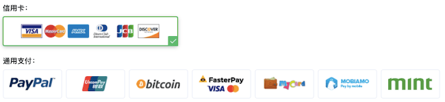
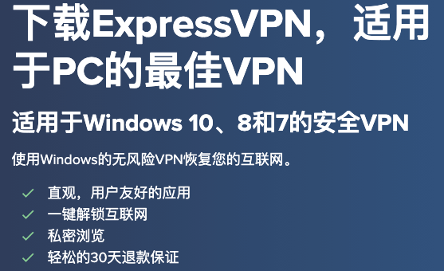
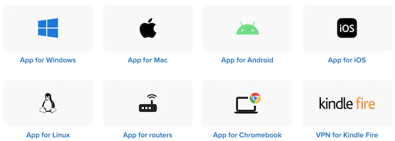
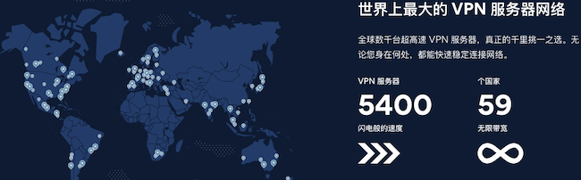
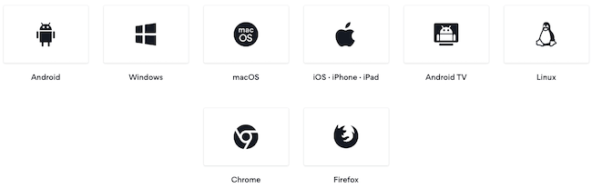
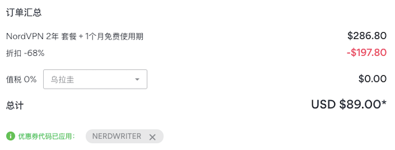
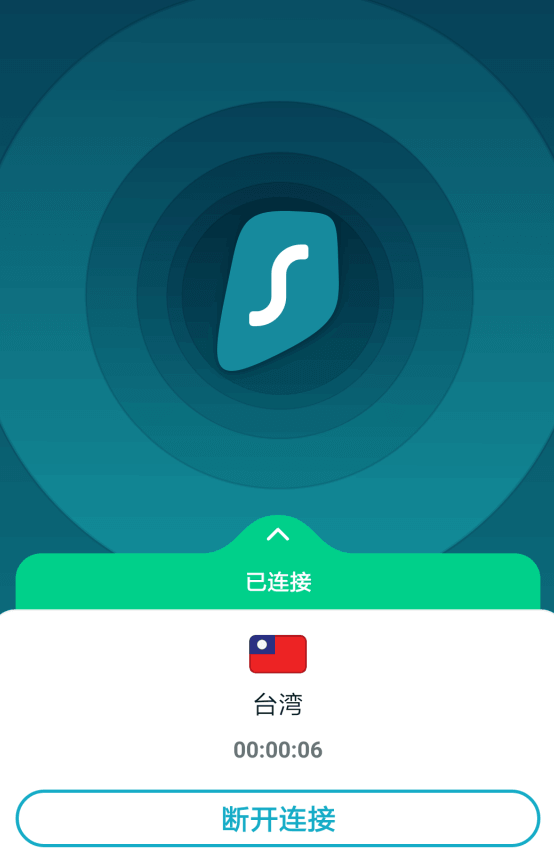

# VPN翻墙与科学上网指南（2020年持续更新）

### [点击此处打开全屏页面，阅读体验更佳](https://super-vpn.github.io/)

### 本文内容真实测评，经常更新，欢迎Star。心急的小伙伴点击下方几个推荐VPN：

|  VPN   | 特点  |
|  ----  | ----  |
| [PandaVPN](https://www.panhdpe.xyz/r/22216799) | 海外华人开发 |
| [NordVPN](https://go.nordlocker.net/aff_c?offer_id=15&aff_id=38201&url_id=6063&aff_sub=github&aff_click_id=supervpn) | 顶级VPN品牌之一 |
| [ExpressVPN](https://www.xvbelink.com/?a_fid=tizi_vpn&chan=github&data1=supervpn) | 顶级品牌（需翻墙后购买）|
| [SurfShark](https://get.surfshark.net/aff_c?offer_id=6&aff_id=3401) | 不限设备数（需翻墙后购买） |
| [IvacyVPN](https://www.ivacykodi.com/easter-deal-2020/?aff=91814&data1=github&data2=supervpn) | 网速一流的VPN |

市场上的翻墙软件多如牛毛，如果你有幸访问国外苹果/安卓应用商店，搜一下”VPN”，能找到几十上百款APP，其中大部分我都试过，没几个能用的。我原本想做一次地毯式测试，但后来失去了耐心，实在太多，就没有继续测了，我可以肯定99.9%都不好用，尤其是那些声称自己“免费”的，你也别浪费时间。我写这篇中国VPN推荐花了很长时间，是我亲自使用过十几款付费VPN后的总结。

我想先提醒读者：没有完美的翻墙软件，不要这样期望。过去几年，我辗转国内外，用过的VPN不算少了，我还从来没碰到过哪个VPN在中国能做到100%稳定不断线的，也从来没碰到过哪个翻墙工具能在不保持持续更新的前提下在中国持续使用的。GFW的屏蔽能力越来越强，它和翻墙软件之间的战斗，会一直持续下去。我们的科学上网事业会一如既往，八仙过海各显神通是常态。

为什么要推荐中国能用的VPN这么难？如此饱和的VPN翻墙软件市场，也难找到几款好用的产品？

我们可以说这是因为墙越来越高，为中国用户开发稳定好用的个软件的技术门槛和成本也越来越高。开发商的焦灼在于：要维持对中国大陆用户的服务，必须有持续投入到算法更新，服务器更新，镜像站维护的财力。在和网络防火墙长期猫捉老鼠的斗争中，99%以上的服务商最终不得不败下阵来。

现在适合中国的VPN加起来恐怕连10款都不到。但读者也别气馁，好消息是，尽管每天都有众多翻墙软件失效，每天也有很多翻墙工具上线。而且重视中国市场的服务商们，一直孜孜不倦地改进着算法，每天增加着更多的服务器，每隔几周都换掉镜像域名，为的就是让你能访问到真正的国际互联网。

写这篇中国VPN推荐，是为帮你找到中国能用好用的翻墙软件。我会尽可能地测试并推荐可靠的翻墙VPN，他们基本上都是付费VPN。

在个人时间允许的前提下，我会保持更新。翻墙软件能否正常使用，除了取决于厂商、产品等因素外，还有无法预测的变量，比如上网时段、网络接入商当时的审查口径、用户自己的上网环境和设备、墙的变化等。

没有人能保证某个翻墙工具能在任何时间任何地点100%可用，如果你根据我的推荐购买了某款翻墙软件却发现无法使用，你可以联系厂商退款，请放心，每款软件都有保证退款的时间段。

# 1
# PandaVPN（熊猫）

> 海外华人开发的VPN，类SSR，目前很好用

翻墙软件中的小黑马。

熊猫VPN总部在美国，由中文团队开发，所以中文支持很好，运营的时间并不长，是中国VPN市场的后期之秀，支持Windows，Mac，iOS，Android。熊猫VPN有国内可直接访问的镜像网站，购买后也可直接从那里下载客户端，无需访问应用商店。

在安卓手机上测试使用了一个小时，非常好用，随机测了香港、美国的几个节点，连接非常快，试了试Youtube，视频的速度也很满意。

根据我个人的使用体验，PandaVPN在敏感时期的穿墙能力比较强，但这还不能说明它的技术更好，也可能是它比较新的缘故。 这个VPN底层很可能不是VPN技术，我的猜测，很可能是SSR类似的技术，因为连接建立连接的速度非常快，而且客户端里提供全局代理或分应用代理的区别，让人浮想联翩，我无法确定熊猫VPN到底是VPN还是SSR那样的代理类翻墙软件，所以暂时把它算作VPN推荐吧。

熊猫VPN支持银联、Paypal、信用卡等支付方式（以前支持支付宝，微信，可能支付被封了），目前还有买一年送一年的优惠，7天无理由退款，到年底圣诞节可能有更大优惠，不要错过。

### [熊猫VPN官网（中国区镜像），可直接打开](https://www.panhdpe.xyz/r/22216799)

万一不能用如何退款？

Panda有7天退款保障，但申请退款需要说明理由。如果你发现它在你的设备和网络环境下不能用，可以用下列方式联系客服，一般客服会协助你解决问题，如果确实为软件问题造成无法使用，会退款：

1. 打开镜像站，等待网页加载完毕，你会看到右下角的在线客服，点击弹出，就可以联系到客服，注意，PandaVPN客服并非7天24小时在线，你最好在美国西部时间的工作时间联系他们。
2. 写邮件给 panda7x24@gmail.com，虽然邮箱名暗示24/7客服，但个人经验，他们会在一个工作日内在美国西部工作时间回。
3. PandaVPN客服支持中文，所以你可以直接用中文表达退款请求。

# 2
# ExpressVPN

> 市场上最强跨设备通用翻墙软件
> 2020年9月起，ExpressVPN不再提供大陆用户可直接访问购买的镜像，但不影响客户端本身在国内使用，
> ExpressVPN仍然是穿墙能力最强的翻墙软件之一。如果用户想购买，可以先用PandaVPN免费试用，获得国外IP后到ExpressVPN官网购买。

这是最好用的中国VPN，虽然特殊时期也碰到问题，但一年中97%的时间里使用都很流畅。每年不能用的时间大致在2-3个星期（即所谓“敏感时期”），会有几天时间出现完全连不上，其余时间会频繁短线或者网速变得非常慢。ExpressVPN全年可用率在97%左右。

ExpressVPN已经为中国网民服务了11年，是可以毫不犹豫购买的VPN，连通率应该是最高的，速度相比其他VPN软件也不慢，隐私保护技术最好，还有最重要的，客户端最好用，设备支持它最全。

客户端好用的VPN不少，但提供无需Google Play Store和苹果美国商店即可安装客户端的VPN厂商，恐怕ExpressVPN是仅有的几家之一。

推荐香港、日本、新加坡、美国节点，真正全终端覆盖，电脑（Windows，MacOS，Linux），手机（安卓，iOS：iPhone，iPad），路由器，游戏主机（PS2，XBox）等，安卓手机无需Google Play也可安装，iOS设备无需访问苹果商店也可安装，同时5台设备，单独配置哪些应用走VPN哪些不走（Split Tunneling） ，买一年送3个月，30天无理由退款，买一年送3个月，支持支付宝付款，支持P2P下载，不限流量。

ExpressVPN已通过普华永道隐私保护机制审计，ExpressVPN的无日志政策是实打实的无日志。

无硬盘服务器，技术上，这种服务器无法保留任何上网痕迹，重启或断掉所以信息都会被抹得一干二净。

智能连接，首先是自动检测最快的服务器，你不需要自己一个个去试，绝大多数情况下软件检测到的（Smart Location）就是当时最佳节点。其次，断线自动重连，虽然只是个小功能但真的很有用，而且每次重连时它会自动切断网络（Kill Switch），防止某些应用程序流量无意间泄露。

同时访问内外网，开VPN最让人烦恼的问题是打开国内网站会变慢，有些甚至会打不开。拆分隧道技术（Split Tunneling）让你配置哪些应用程序走VPN加密通道，哪些不走。

DNS泄露保护。ExpressVPN在每台服务器上运行自己的私有加密DNS服务器，一旦连上，所有上网的DNS请求都会通过这些私有的域名服务器，不走任何公网服务器，你的上网隐私得到进一步保护。

ExpresssVPN的缺点是它的价格较贵。未必是市场上价格最高的VPN，但至少是之一。目前提供三种套餐，单月12.95美金每月，买6个月为9.99美金每月，总计约60美金，买一年为8.32美金每月，总计约99美金，折合人民币700块每年，对不少读者确实有点贵，遇上活动，有买一年送3个月，折合起来每个月6刀多一点。

ExpressVPN支持的付款方式很多，包括支付宝、银联。

香港、日本、美西是国内最好用的服务器，英国、新加坡和澳大利亚的节点有时候速度也不错。

### [ExpressVPN官网镜像，需翻墙后打开（本来支持直接打开，受某些因素影响，官方主动屏蔽了）](https://www.xvbelink.com/?a_fid=tizi_vpn&chan=github&data1=supervpn)

ExpressVPN提供30天内无理由退款，如果你发现它在你的设备和网络环境下用不了，你可以有两种方式联系它们退款。

1. 打开镜像站，等页面装载完毕后，你会看到右下方的“在线客服”入口，点进去就能联系到客服，他们7天24小时都有人。
2. 写邮件给 support@expressvpn.com，他们一般会在一个工作日内回复。

客服不支持中文，但你可以用下面简单的英文措辞：

> Hi，
>
> I would like to have a refund, because your service does not work for me. My account is xxx@xxx（你自己的注册邮箱）.
>
> Thank you.

# 3
# NordVPN

NordVPN也是老牌的VPN，世界顶级的VPN厂商，之前有段时间在国内使用不稳定，不过经过一段时间的优化，NordVPN现在又非常好用了。

这个VPN有广泛的设备支持：Windows，Mac，Linux，Android，iOS … 没有ExpressVPN那么面面俱到，但能满足绝大多数用户的需要了。价格比ExpressVPN要便宜不少。

在中国使用NordVPN不再需要特别操作，只需要点击快速连接（Quick Connect）按钮，客户端会自动连上最快连接。

NordVPN经常性的有促销活动，有些活动是官方说明“以后不会再有”，所以遇到活动就别犹豫了。

NordVPN官方还有所谓的优惠券，实际上赠送时长，一般是1个月，但与套餐绑定，必须买2年套餐才有用：

#### 最近有效的优惠码是 NERDWRITER

有需要优惠码的，可以在[Issues](https://github.com/Super-VPN/Super-VPN.github.io/issues)里留言，我尽力帮大家找！

### [NordVPN官网镜像，可直接打开](https://go.nordlocker.net/aff_c?offer_id=15&aff_id=38201&url_id=6063&aff_sub=github&aff_click_id=supervpn)

NordVPN支持30天无理由退款，如果你发现它在你的设备和网络环境下用不了，你可以写邮件 support@nordvpn.com 要求退款：

> Hi，
>
> I would like to have a refund, because your service does not work for me. My account is xxx@xxx（你自己的注册邮箱）.
>
> Thank you.

# 4
# SurfShark

> 市场上少有的不限设备数量的VPN

不限设备数量： 这可能是SurfShark最大的优点，多数其它翻墙软件都只提供有限的同时连接数（设备），而SurfShark允许用户在任意多台设备上任意使用。

广告拦截： SurfShark自带拦截程序，能有效屏蔽众多广告、跟踪脚本，恶意程序或钓鱼软件。并非所有翻墙软件都提供广告拦截，坦白说，我个人并不觉得对中国VPN来说是特别重要的功能。

支持设备： SurfShark支持Windows，MacOS，Linux，iOS，Android，FireTV等设备，也提供Chrome、Firefox浏览器插件。

智能连接： 允许分应用配置流量是否通过VPN线路，如你可以配置你的Torrent下载软件走SurfShark，而让你的Chrome浏览器直接走公网访问国内网站。

安全与隐私保护： SurfShark保证严格的务日志政策，提供连接时自动断网保护，能有效防止DNS泄露。

价格与优惠： SurfShark提供三种套餐，买单月价格为11.95美金，买一年为5.99美金每月，总计约71美金，买27个月价格为1.77美金每月，总计约47美金。在西方重大节日里都有较大促销活动。

解除网飞（Netflix）观看限制： 提供美国即其他15个国家的IP，能自由订阅观看当地的网飞节目。

7/24客服： SurfShark提供7天24小时客服，你可以随时在线联系他们。

SurfShark目前只能通过官网购买，要先翻墙，可以用PandaVPN的免费试用，先获取国外IP，再进行购买。

[SurfShark官网地址，翻墙后打开](https://get.surfshark.net/aff_c?offer_id=6&aff_id=3401)

SurfShark提供30天退款保证，如果购买后你的设备或网络环境下无法使用，而已联系它们退款：

1. 打开官网，等待页面装载完毕，在右下角找到“Chat”按钮，和它们的在线客服沟通，它们是7/24在线的
2. 写邮件给 support@surfshark.com 告诉客服你的账号即可。

