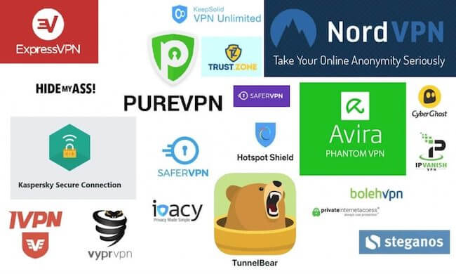
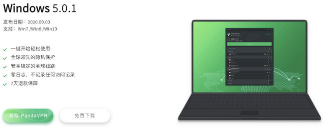
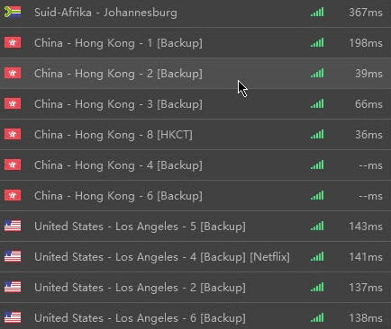
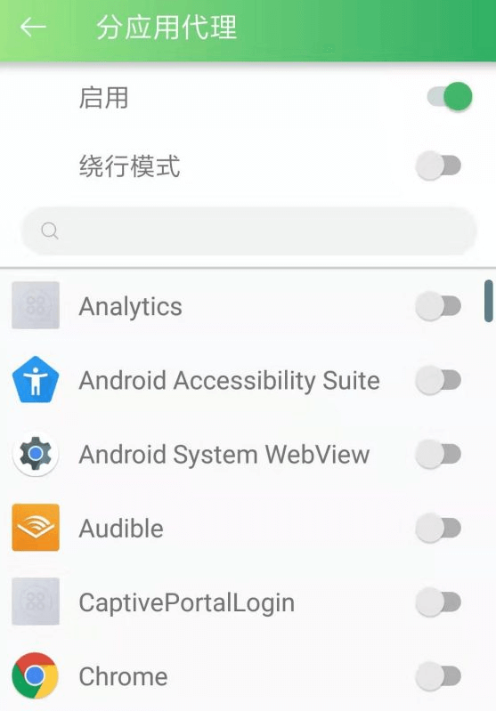

# VPN翻墙与科学上网指南（2020年持续更新）

### [点击打开放大版页面，阅读体验更佳](https://super-vpn.github.io/)

### 本文比较啰嗦， 如果不想看，可以直接点击下方几个推荐VPN（持续更新）：

|  VPN   | 特点  |
|  ----  | ----  |
| [PandaVPN](https://www.panhdpe.xyz/r/22216799) | 海外华人开发 |
| [Nord官网地址](https://go.nordlocker.net/aff_c?offer_id=15&aff_id=38201&url_id=6063&aff_sub=github&aff_click_id=supervpn) | 顶级VPN品牌之一 |
| [IvacyVPN](https://www.ivacykodi.com/easter-deal-2020/?aff=91814&data1=github&data2=supervpn) | 网速一流的VPN |

市场上的翻墙软件多如牛毛，如果你有幸访问国外苹果/安卓应用商店，搜一下”VPN”，能找到几十上百款APP，其中大部分我都试过，没几个能用的。我原本想做一次地毯式测试，但后来失去了耐心，实在太多，就没有继续测了，我可以肯定99.9%都不好用，尤其是那些声称自己“免费”的，你也别浪费时间。我写这篇中国VPN推荐花了很长时间，是我亲自使用过十几款付费VPN后的总结。

我想先提醒读者：没有完美的翻墙软件，不要这样期望。过去几年，我辗转国内外，用过的VPN不算少了，我还从来没碰到过哪个VPN在中国能做到100%稳定不断线的，也从来没碰到过哪个翻墙工具能在不保持持续更新的前提下在中国持续使用的。GFW的屏蔽能力越来越强，它和翻墙软件之间的战斗，会一直持续下去。我们的科学上网事业会一如既往，八仙过海各显神通是常态。

为什么要推荐中国能用的VPN这么难？如此饱和的VPN翻墙软件市场，也难找到几款好用的产品？

我们可以说这是因为墙越来越高，为中国用户开发稳定好用的个软件的技术门槛和成本也越来越高。开发商的焦灼在于：要维持对中国大陆用户的服务，必须有持续投入到算法更新，服务器更新，镜像站维护的财力。在和网络防火墙长期猫捉老鼠的斗争中，99%以上的服务商最终不得不败下阵来。

现在适合中国的VPN加起来恐怕连10款都不到。但读者也别气馁，好消息是，尽管每天都有众多翻墙软件失效，每天也有很多翻墙工具上线。而且重视中国市场的服务商们，一直孜孜不倦地改进着算法，每天增加着更多的服务器，每隔几周都换掉镜像域名，为的就是让你能访问到真正的国际互联网。

写这篇中国VPN推荐，是为帮你找到中国能用好用的翻墙软件。我会尽可能地测试并推荐可靠的翻墙VPN，他们基本上都是付费VPN。

在个人时间允许的前提下，我会保持更新。翻墙软件能否正常使用，除了取决于厂商、产品等因素外，还有无法预测的变量，比如上网时段、网络接入商当时的审查口径、用户自己的上网环境和设备、墙的变化等。

没有人能保证某个翻墙工具能在任何时间任何地点100%可用，如果你根据我的推荐购买了某款翻墙软件却发现无法使用，你可以联系厂商退款，请放心，每款软件都有保证无理由退款的时间段。

我个人用过并确认过的最可靠的几款翻墙软件（列表持续更新）：

1. PandaVPN：后起之秀，使用类SSR技术，连接速度快
2. ExpressVPN：世界VPN第一品牌，服务中国用户10余年 （可惜须翻墙才能买到）
3. NordVPN：完成技术更新，总算可以稳定使用了

PandaVPN的运营时间虽然不长，但非常好用，连接速度快，提供香港/美国/台湾/日韩等多国节点，甚至还有有中国大陆节点可以翻墙回国，虽然设备支持远没有ExpressVPN全，隐私保护政策也显模糊，但日常使用是个很好的工具。如果你用PandaVPN，请连备用节点，因为用户数增长太快，原节点很多经常爆满，备用节点更新得很快也很多，可以放心使用。

# PandaVPN（熊猫）

> 海外华人开发的VPN，类SSR，目前很好用

翻墙软件中的小黑马。

熊猫VPN总部在美国，由中文团队开发，所以中文支持很好，运营的时间并不长，是中国VPN市场的后期之秀，支持Windows，Mac，iOS，Android。熊猫VPN有国内可直接访问的镜像网站，购买后也可直接从那里下载客户端，无需访问应用商店。

在安卓手机上测试使用了一个小时，非常好用，随机测了香港、美国的几个节点，连接非常快，试了试Youtube，视频的速度也很满意。

根据我个人的使用体验，PandaVPN在敏感时期的穿墙能力比较强，但这还不能说明它的技术更好，也可能是它比较新的缘故。 这个VPN底层很可能不是VPN技术，我的猜测，很可能是SSR类似的技术，因为连接建立连接的速度非常快，而且客户端里提供全局代理或分应用代理的区别，让人浮想联翩，我无法确定熊猫VPN到底是VPN还是SSR那样的代理类翻墙软件，所以暂时把它算作VPN推荐吧。

熊猫VPN支持银联、Paypal、信用卡等支付方式（以前支持支付宝，微信，可能支付被封了），目前还有买一年送一年的优惠，7天无理由退款，到年底圣诞节可能有更大优惠，不要错过。

### [熊猫VPN官网（中国区镜像），可直接打开](https://www.panhdpe.xyz/r/22216799)

万一不能用如何退款？

Panda有7天退款保障，但申请退款需要说明理由。如果你发现它在你的设备和网络环境下不能用，可以用下列方式联系客服，一般客服会协助你解决问题，如果确实为软件问题造成无法使用，会退款：

1. 打开镜像站，等待网页加载完毕，你会看到右下角的在线客服，点击弹出，就可以联系到客服，注意，PandaVPN客服并非7天24小时在线，你最好在美国西部时间的工作时间联系他们。
2. 写邮件给 panda7x24@gmail.com，虽然邮箱名暗示24/7客服，但个人经验，他们会在一个工作日内在美国西部工作时间回。
3. PandaVPN客服支持中文，所以你可以直接用中文表达退款请求。

